# QuikApp Platform - Complete Project Report & Workflow Analysis

## 📋 Executive Summary

**QuikApp** is a comprehensive Flutter-based mobile app platform that converts user websites into native Android and iOS applications using Codemagic CI/CD. The platform supports 6 distinct workflows with dynamic configuration, automated build processes, and professional email notifications.

### Platform Architecture

- **Frontend**: Flutter 3.32.2 framework
- **Build System**: Codemagic CI/CD with Mac Mini M2 instances
- **Target Platforms**: Android (APK/AAB) & iOS (IPA)
- **Configuration**: Dynamic environment variable injection
- **Notification System**: Professional HTML email notifications

---

## 🏗️ Available Workflows Overview

| Workflow ID       | Platform | Purpose                 | Output          | Build Time | Features                   |
| ----------------- | -------- | ----------------------- | --------------- | ---------- | -------------------------- |
| `android-free`    | Android  | Free tier testing       | APK             | 60 min     | No Firebase, Debug signing |
| `android-paid`    | Android  | Paid tier with features | APK             | 60 min     | Firebase, Debug signing    |
| `android-publish` | Android  | Production release      | APK + AAB       | 60 min     | Firebase, Release signing  |
| `ios-appstore`    | iOS      | App Store distribution  | IPA             | 60 min     | App Store profile          |
| `ios-adhoc`       | iOS      | Ad Hoc distribution     | IPA             | 60 min     | Ad Hoc profile             |
| `combined`        | Both     | Universal build         | APK + AAB + IPA | 120 min    | Auto-detection             |

---

## 📱 Detailed Workflow Analysis

### 1. Android-Free Workflow

```yaml
workflow_id: android-free
entry_point: lib/scripts/android/main.sh
purpose: Development and testing builds
features:
  - APK generation only
  - Debug signing (no keystore required)
  - Asset customization
  - Permission configuration
  - Email notifications
  - NO Firebase integration
  - NO production signing
```

**Process Flow:**

1. Environment Setup & Optimization
2. Version Management & Conflict Resolution
3. **📦 Dynamic Package Name Update** (NEW)
4. Asset Download & Branding
5. App Customization
6. Permission Configuration
7. Build APK (debug signed)
8. Artifact Processing & Email Notification

### 2. Android-Paid Workflow

```yaml
workflow_id: android-paid
entry_point: lib/scripts/android/main.sh
purpose: Feature-rich apps with Firebase
features:
  - APK generation only
  - Debug signing (no keystore required)
  - Firebase integration (if PUSH_NOTIFY=true)
  - Asset customization
  - Permission configuration
  - Email notifications
```

**Process Flow:**

1. Environment Setup & Optimization
2. Version Management & Conflict Resolution
3. **📦 Dynamic Package Name Update** (NEW)
4. Asset Download & Branding
5. App Customization
6. Permission Configuration
7. Firebase Configuration (conditional)
8. Build APK (debug signed)
9. Artifact Processing & Email Notification

### 3. Android-Publish Workflow

```yaml
workflow_id: android-publish
entry_point: lib/scripts/android/main.sh
purpose: Production releases for Google Play
features:
  - APK + AAB generation
  - Release signing with keystore
  - Firebase integration
  - Asset customization
  - Permission configuration
  - Email notifications
  - Production-ready builds
```

**Process Flow:**

1. Environment Setup & Optimization
2. Version Management & Conflict Resolution
3. **📦 Dynamic Package Name Update** (NEW)
4. Asset Download & Branding
5. App Customization
6. Permission Configuration
7. Firebase Configuration
8. Keystore Setup & Validation
9. Build APK + AAB (release signed)
10. Signing Verification
11. Artifact Processing & Email Notification

### 4. iOS-AppStore Workflow

```yaml
workflow_id: ios-appstore
entry_point: lib/scripts/ios/main.sh
purpose: App Store distribution
features:
  - IPA generation for App Store
  - App Store provisioning profile
  - Distribution certificate handling
  - Firebase integration (conditional)
  - Asset customization
  - Permission configuration
  - Email notifications
```

**Process Flow:**

1. Environment Setup & iOS Optimization
2. Asset Download & Branding
3. App Customization (iOS)
4. Permission Configuration (iOS)
5. Firebase Configuration (iOS, conditional)
6. Certificate & Profile Setup (App Store)
7. Build IPA (App Store signed)
8. Artifact Processing & Email Notification

### 5. iOS-AdHoc Workflow

```yaml
workflow_id: ios-adhoc
entry_point: lib/scripts/ios/main.sh
purpose: Beta testing and device-specific distribution
features:
  - IPA generation for Ad Hoc
  - Ad Hoc provisioning profile
  - Distribution certificate handling
  - Firebase integration (conditional)
  - Asset customization
  - Permission configuration
  - Email notifications
```

**Process Flow:**

1. Environment Setup & iOS Optimization
2. Asset Download & Branding
3. App Customization (iOS)
4. Permission Configuration (iOS)
5. Firebase Configuration (iOS, conditional)
6. Certificate & Profile Setup (Ad Hoc)
7. Build IPA (Ad Hoc signed)
8. Artifact Processing & Email Notification

### 6. Combined Universal Workflow

```yaml
workflow_id: combined
entry_point: lib/scripts/combined/main.sh
purpose: Universal cross-platform builds with auto-detection
features:
  - APK + AAB + IPA generation
  - Auto-detection of Android/iOS requirements
  - Dynamic Firebase configuration
  - Dynamic signing configuration
  - Asset customization for both platforms
  - Permission configuration for both platforms
  - Email notifications
  - Intelligent build optimization
```

**Process Flow:**

1. Universal Build Configuration Detection
2. Android & iOS Requirement Analysis
3. Environment Setup & Cross-Platform Optimization
4. Version Management & Conflict Resolution
5. **📦 Dynamic Package Name Update** (Both platforms)
6. Asset Download & Branding (Both platforms)
7. App Customization (Both platforms)
8. Permission Configuration (Both platforms)
9. Firebase Configuration (Both platforms, conditional)
10. Android Keystore Setup (conditional)
11. iOS Certificate Setup (conditional)
12. Build Android (APK + AAB, conditional)
13. Build iOS (IPA, conditional)
14. Artifact Processing & Email Notification

---

## 📁 File-by-File Process Analysis

### 🤖 Android Scripts (`lib/scripts/android/`)

#### `main.sh` - Android Main Build Controller

**Size:** 21KB, 622 lines
**Purpose:** Primary Android build orchestrator
**Key Functions:**

- Environment configuration and optimization
- Build.gradle.kts dynamic generation
- Error handling and recovery
- Build process coordination
- Artifact management

**Process Steps:**

1. **Environment Setup**

   - Force fix env_config.dart (BRANCH issue resolution)
   - Source environment variables and build acceleration
   - Generate environment configuration
   - Initialize logging system

2. **Build Configuration**

   - Ensure Java imports in build.gradle.kts
   - Generate workflow-specific build.gradle.kts
   - Configure keystore settings (conditional)
   - Set up build type configurations

3. **Error Handling Setup**

   - Trap error handler configuration
   - Emergency cleanup procedures
   - System diagnostics
   - Email notification on failure

4. **Build Process Execution**

   - Version management
   - **📦 Package name update** (NEW)
   - Asset download and branding
   - Custom icons download
   - App customization
   - Permission configuration
   - Firebase setup
   - Keystore configuration

5. **Flutter Build**

   - Environment verification
   - Flutter clean and pub get
   - APK/AAB build based on workflow
   - Gradle daemon management

6. **Artifact Processing**
   - Smart artifact detection
   - Copy to output directory
   - Signing verification
   - URL processing for email
   - Success email notification

#### `update_package_name.sh` - Dynamic Package Name Updater (NEW)

**Size:** 9.2KB, 240 lines
**Purpose:** Automatically update package names across all project files
**Key Functions:**

- Dynamic package name detection
- Cross-platform sed compatibility
- Java/Kotlin directory restructuring
- iOS file updates (combined workflow)

**Process Steps:**

1. **Detection Phase**

   - Scan for old package names
   - Check PKG_NAME environment variable
   - Log target package name

2. **Update Phase**

   - Update AndroidManifest.xml files
   - Update build.gradle.kts applicationId
   - Update Java/Kotlin package declarations
   - Restructure package directories

3. **iOS Updates (Combined Workflow)**

   - Update iOS project.pbxproj
   - Update iOS Info.plist

4. **Cleanup Phase**
   - Remove build artifacts
   - Clean empty directories
   - Remove iOS Podfile.lock (if applicable)

#### `keystore.sh` - Android Keystore Management

**Size:** 7.7KB, 212 lines
**Purpose:** Handle Android app signing with keystore
**Key Functions:**

- Keystore validation and setup
- Error handling with email notifications
- Key.properties file generation

**Process Steps:**

1. **Validation Flow**

   - Check KEY_STORE_URL presence
   - Validate keystore credentials
   - Download keystore file
   - Install keystore for signing

2. **Error Handling**
   - Email alerts for missing credentials
   - Download failure notifications
   - Setup error notifications
   - Graceful fallback to debug signing

#### `version_management.sh` - Version & Conflict Resolution

**Size:** 11KB, 341 lines
**Purpose:** Manage app versioning and resolve package conflicts
**Key Functions:**

- Version code and name management
- Package name conflict resolution
- Pubspec.yaml updates

#### `customization.sh` - App Customization

**Size:** 3.8KB, 101 lines
**Purpose:** Apply user-specific app customizations
**Key Functions:**

- Package name updates in build files
- App name configuration
- App icon replacement

#### `branding.sh` - Asset Download & Branding

**Size:** 6.2KB, 170 lines
**Purpose:** Download and apply branding assets
**Key Functions:**

- Logo and splash screen download
- Image optimization
- Asset validation

#### `firebase.sh` - Firebase Configuration

**Size:** 2.3KB, 59 lines
**Purpose:** Configure Firebase for Android
**Key Functions:**

- google-services.json setup
- Firebase dependency configuration

#### `permissions.sh` - Android Permission Configuration

**Size:** 4.2KB, 121 lines
**Purpose:** Configure Android permissions based on feature flags
**Key Functions:**

- AndroidManifest.xml permission injection
- Feature-based permission mapping

#### `verify_signing.sh` - Build Verification

**Size:** 2.5KB, 75 lines
**Purpose:** Verify APK/AAB signing status
**Key Functions:**

- Signing certificate verification
- Build integrity checks

#### `install_helper.sh` - Installation Utilities

**Size:** 9.4KB, 298 lines
**Purpose:** Helper utilities for Android build process
**Key Functions:**

- Dependency installation
- Build environment setup

### 🍎 iOS Scripts (`lib/scripts/ios/`)

#### `main.sh` - iOS Main Build Controller

**Size:** 20KB, 611 lines
**Purpose:** Primary iOS build orchestrator
**Key Functions:**

- iOS environment setup
- Certificate and profile management
- Build process coordination
- Artifact management

**Process Steps:**

1. **Environment Setup**

   - iOS-specific optimizations
   - Xcode configuration
   - CocoaPods setup

2. **Asset Management**

   - iOS branding setup
   - Asset optimization

3. **Configuration**

   - App customization
   - Permission setup
   - Firebase configuration

4. **Certificate Handling**

   - Certificate validation
   - Profile setup
   - Signing configuration

5. **Build Process**
   - Flutter iOS build
   - IPA generation
   - Artifact processing

#### `certificate_handler.sh` - iOS Certificate Management

**Size:** 8.3KB, 193 lines
**Purpose:** Handle iOS certificates and provisioning profiles
**Key Functions:**

- P12 certificate handling
- CER/KEY conversion to P12
- Provisioning profile installation
- Keychain management

#### `branding.sh` - iOS Asset Management

**Size:** 4.5KB, 121 lines
**Purpose:** iOS-specific branding and assets
**Key Functions:**

- iOS icon generation
- Launch screen configuration
- Asset optimization

#### `customization.sh` - iOS App Customization

**Size:** 2.6KB, 53 lines
**Purpose:** iOS-specific app customizations
**Key Functions:**

- Bundle ID configuration
- App name setup
- Info.plist updates

#### `permissions.sh` - iOS Permission Configuration

**Size:** 3.2KB, 74 lines
**Purpose:** Configure iOS permissions and usage descriptions
**Key Functions:**

- Info.plist permission injection
- Usage description setup

#### `firebase.sh` - iOS Firebase Configuration

**Size:** 2.6KB, 65 lines
**Purpose:** Configure Firebase for iOS
**Key Functions:**

- GoogleService-Info.plist setup
- Firebase dependency configuration

#### `testflight_upload.sh` - TestFlight Integration

**Size:** 2.0KB, 68 lines
**Purpose:** Upload IPA to TestFlight
**Key Functions:**

- TestFlight upload automation
- App Store Connect integration

#### `deployment_target.sh` - iOS Deployment Configuration

**Size:** 1.5KB, 47 lines
**Purpose:** Configure iOS deployment targets
**Key Functions:**

- Minimum iOS version setup
- Deployment target validation

### 🔧 Utility Scripts (`lib/scripts/utils/`)

#### `gen_env_config.sh` - Environment Configuration Generator

**Size:** 18KB, 363 lines
**Purpose:** Generate Dart environment configuration from Codemagic variables
**Key Functions:**

- Dynamic Dart code generation
- Environment variable mapping
- Type-safe configuration

#### `force_fix_env_config.sh` - Critical Environment Fix

**Size:** 4.8KB, 136 lines
**Purpose:** Force fix the $BRANCH compilation error
**Key Functions:**

- Static environment configuration
- Cache clearing
- Compilation error prevention

#### `build_acceleration.sh` - Build Optimization

**Size:** 7.8KB, 266 lines
**Purpose:** Optimize build performance across platforms
**Key Functions:**

- JVM optimization
- Gradle configuration
- Cache management
- Parallel processing

#### `send_email.sh` - Email Notification System

**Size:** 34KB, 795 lines
**Purpose:** Professional email notifications for build status
**Key Functions:**

- HTML email generation
- SMTP configuration
- Build status reporting
- Artifact URL integration

#### `send_email.py` - Python Email Backend

**Size:** 36KB, 645 lines
**Purpose:** Python-based email sending with rich formatting
**Key Functions:**

- Advanced email templates
- Image embedding
- Error handling

#### `process_artifacts.sh` - Artifact URL Processing

**Size:** 2.4KB, 63 lines
**Purpose:** Process Codemagic artifact URLs for email notifications
**Key Functions:**

- JSON parsing with jq
- Public URL prioritization
- Download link generation

#### `download_custom_icons.sh` - Custom Icon Management

**Size:** 3.8KB, 145 lines
**Purpose:** Download and process custom icons for bottom menu
**Key Functions:**

- Icon URL parsing
- Image optimization
- Asset validation

#### `verify_package_names.sh` - Package Name Verification

**Size:** 8.0KB, 241 lines
**Purpose:** Verify package name consistency across project
**Key Functions:**

- Cross-file package name validation
- Conflict detection
- Reporting

### 🌐 Combined Workflow Script

#### `lib/scripts/combined/main.sh` - Universal Build Controller

**Size:** Not specified in search results
**Purpose:** Orchestrate combined Android + iOS builds with intelligent detection
**Key Functions:**

- Auto-detection of Android/iOS requirements
- Cross-platform optimization
- Unified artifact management

---

## 🔧 Configuration Variables

### Core App Configuration

```yaml
# Application Identity
APP_ID: Unique application identifier
WORKFLOW_ID: Build workflow type
BRANCH: Git branch name
VERSION_NAME: App version (e.g., "1.0.0")
VERSION_CODE: Build number
APP_NAME: Display name
ORG_NAME: Organization name
WEB_URL: Website URL
EMAIL_ID: Contact email
USER_NAME: User identifier

# Platform Identifiers
PKG_NAME: Android package name (e.g., "com.company.app")
BUNDLE_ID: iOS bundle identifier
```

### Feature Flags

```yaml
# Core Features
PUSH_NOTIFY: Enable push notifications (true/false)
IS_CHATBOT: Enable chatbot integration (true/false)
IS_DOMAIN_URL: Enable deep linking (true/false)
IS_SPLASH: Enable splash screen (true/false)
IS_PULLDOWN: Enable pull-to-refresh (true/false)
IS_BOTTOMMENU: Enable bottom navigation (true/false)
IS_LOAD_IND: Enable loading indicators (true/false)

# Permissions
IS_CAMERA: Camera access (true/false)
IS_LOCATION: Location access (true/false)
IS_MIC: Microphone access (true/false)
IS_NOTIFICATION: Notification permissions (true/false)
IS_CONTACT: Contacts access (true/false)
IS_BIOMETRIC: Biometric authentication (true/false)
IS_CALENDAR: Calendar access (true/false)
IS_STORAGE: Storage access (true/false)
```

### UI/Branding Configuration

```yaml
# Visual Assets
LOGO_URL: App logo image URL
SPLASH_URL: Splash screen image URL
SPLASH_BG_URL: Splash background image URL

# Splash Screen Settings
SPLASH_BG_COLOR: Background color
SPLASH_TAGLINE: Tagline text
SPLASH_TAGLINE_COLOR: Tagline color
SPLASH_ANIMATION: Animation type
SPLASH_DURATION: Display duration

# Bottom Menu (if IS_BOTTOMMENU=true)
BOTTOMMENU_ITEMS: Menu items configuration
BOTTOMMENU_BG_COLOR: Background color
BOTTOMMENU_ICON_COLOR: Icon color
BOTTOMMENU_TEXT_COLOR: Text color
BOTTOMMENU_FONT: Font family
BOTTOMMENU_FONT_SIZE: Font size
BOTTOMMENU_FONT_BOLD: Bold text (true/false)
BOTTOMMENU_FONT_ITALIC: Italic text (true/false)
BOTTOMMENU_ACTIVE_TAB_COLOR: Active tab color
BOTTOMMENU_ICON_POSITION: Icon position
BOTTOMMENU_VISIBLE_ON: Visibility settings
```

### Android Configuration

```yaml
# Firebase (if PUSH_NOTIFY=true)
FIREBASE_CONFIG_ANDROID: google-services.json content

# Keystore (for android-publish workflow)
KEY_STORE_URL: Keystore file URL
CM_KEYSTORE_PASSWORD: Keystore password
CM_KEY_ALIAS: Key alias
CM_KEY_PASSWORD: Key password
```

### iOS Configuration

```yaml
# Firebase (if PUSH_NOTIFY=true)
FIREBASE_CONFIG_IOS: GoogleService-Info.plist content

# Certificates & Profiles
APPLE_TEAM_ID: Apple Developer Team ID
CERT_PASSWORD: Certificate password
PROFILE_URL: Provisioning profile URL
PROFILE_TYPE: "app-store" or "ad-hoc"

# Certificate Options (choose one)
CERT_P12_URL: Pre-made P12 certificate URL
# OR
CERT_CER_URL: Certificate file URL
CERT_KEY_URL: Private key file URL

# Push Notifications (if PUSH_NOTIFY=true)
APNS_KEY_ID: APNs key identifier
APNS_AUTH_KEY_URL: APNs auth key URL

# App Store Connect
APP_STORE_CONNECT_KEY_IDENTIFIER: API key identifier
IS_TESTFLIGHT: TestFlight upload (true/false)

# Distribution Options
ENABLE_DEVICE_SPECIFIC_BUILDS: Device-specific builds
INSTALL_URL: Installation URL
DISPLAY_IMAGE_URL: Display image URL
FULL_SIZE_IMAGE_URL: Full-size image URL
THINNING: App thinning options
```

### Email Notification System

```yaml
ENABLE_EMAIL_NOTIFICATIONS: "true"
EMAIL_SMTP_SERVER: "smtp.gmail.com"
EMAIL_SMTP_PORT: "587"
EMAIL_SMTP_USER: SMTP username
EMAIL_SMTP_PASS: SMTP password
```

### Build Optimization

```yaml
# Gradle Optimization
GRADLE_OPTS: JVM options for Gradle
GRADLE_DAEMON: Enable Gradle daemon
GRADLE_PARALLEL: Enable parallel builds
GRADLE_CACHING: Enable build caching

# iOS Optimization
XCODE_PARALLEL_JOBS: Parallel job count
XCODE_FAST_BUILD: Fast build mode
COCOAPODS_FAST_INSTALL: Fast CocoaPods install
XCODE_OPTIMIZATION: Enable optimizations

# Asset Optimization
ASSET_OPTIMIZATION: Enable asset optimization
IMAGE_COMPRESSION: Enable image compression
PARALLEL_DOWNLOADS: Enable parallel downloads
```

---

## 🚀 Build Process Flow Diagram

```mermaid
graph TD
    A[Start Build] --> B{Workflow Type?}

    B -->|android-free| C[Android Free Process]
    B -->|android-paid| D[Android Paid Process]
    B -->|android-publish| E[Android Publish Process]
    B -->|ios-appstore| F[iOS App Store Process]
    B -->|ios-adhoc| G[iOS Ad Hoc Process]
    B -->|combined| H[Universal Combined Process]

    C --> I[Environment Setup]
    D --> I
    E --> I

    I --> J[Version Management]
    J --> K[📦 Package Name Update]
    K --> L[Asset Download]
    L --> M[App Customization]
    M --> N[Permission Config]
    N --> O[Firebase Setup]
    O --> P[Keystore Setup]
    P --> Q[Build APK/AAB]
    Q --> R[Verify Signing]
    R --> S[Process Artifacts]
    S --> T[Send Email]
    T --> U[Complete]

    F --> V[iOS Environment Setup]
    G --> V

    V --> W[iOS Asset Download]
    W --> X[iOS Customization]
    X --> Y[iOS Permissions]
    Y --> Z[iOS Firebase]
    Z --> AA[Certificate Setup]
    AA --> BB[Build IPA]
    BB --> CC[Process iOS Artifacts]
    CC --> DD[Send iOS Email]
    DD --> EE[Complete]

    H --> FF[Universal Detection]
    FF --> GG[Android Path]
    FF --> HH[iOS Path]
    GG --> II[Combined Android Build]
    HH --> JJ[Combined iOS Build]
    II --> KK[Combined Artifacts]
    JJ --> KK
    KK --> LL[Combined Email]
    LL --> MM[Complete]
```



---

## 📊 Build Time & Resource Analysis

### Build Duration by Workflow

| Workflow        | Max Duration | Typical Duration | Instance Type |
| --------------- | ------------ | ---------------- | ------------- |
| android-free    | 60 min       | 15-25 min        | mac_mini_m2   |
| android-paid    | 60 min       | 20-30 min        | mac_mini_m2   |
| android-publish | 60 min       | 25-35 min        | mac_mini_m2   |
| ios-appstore    | 60 min       | 30-40 min        | mac_mini_m2   |
| ios-adhoc       | 60 min       | 30-40 min        | mac_mini_m2   |
| combined        | 120 min      | 45-60 min        | mac_mini_m2   |

### Resource Optimization

- **JVM Settings**: 8GB heap, G1GC, optimized for build performance
- **Gradle**: Daemon enabled, parallel builds, caching enabled
- **Xcode**: 6 parallel jobs, fast build mode
- **Asset Processing**: Parallel downloads, image compression

---

## 🔐 Security Features

### Certificate Management

- ✅ Encrypted P12 certificates with password protection
- ✅ Separate CER/KEY file support for enhanced security
- ✅ Secure URL-based certificate delivery
- ✅ Environment variable encryption in Codemagic

### Keystore Security

- ✅ Secure keystore URL delivery
- ✅ Encrypted keystore passwords
- ✅ Validation flow with error handling
- ✅ Graceful fallback to debug signing

### Email Security

- ✅ SMTP authentication
- ✅ TLS encryption
- ✅ Secure credential storage

---

## 📈 Success Metrics & Monitoring

### Email Notification Types

1. **Build Started** 🚀

   - App configuration summary
   - Feature flags status
   - Build environment details

2. **Build Success** 🎉

   - Artifact download links
   - Build configuration summary
   - Next steps guidance

3. **Build Failed** ❌
   - Error details and context
   - Troubleshooting guide
   - Recovery instructions

### Artifact Outputs

- **Android**: APK (always), AAB (publish workflow)
- **iOS**: IPA with appropriate signing
- **Combined**: All artifacts from both platforms

---

## 🎯 Best Practices & Recommendations

### For Development

1. Use `android-free` for initial testing
2. Use `ios-adhoc` for iOS beta testing
3. Use `combined` for cross-platform development

### For Production

1. Use `android-publish` for Google Play Store
2. Use `ios-appstore` for App Store distribution
3. Use `combined` with proper certificates for both stores

### Configuration Management

1. Set all required environment variables in Codemagic
2. Use secure URLs for certificates and assets
3. Enable email notifications for build monitoring
4. Regularly update certificates and provisioning profiles

---

## 🔄 Recent Enhancements

### Dynamic Package Name Update System (NEW)

- **Purpose**: Automatically update package names across all project files
- **Integration**: Added to all Android workflows and combined workflow
- **Benefits**: Eliminates manual package name configuration errors
- **Files Updated**: AndroidManifest.xml, build.gradle.kts, Java/Kotlin files, iOS files

### Enhanced Email System

- **Professional HTML templates** with QuikApp branding
- **Comprehensive build summaries** with feature status
- **Artifact download integration** with public URL prioritization
- **Error reporting** with troubleshooting guides

### Build Optimization

- **JVM tuning** for faster builds
- **Gradle optimization** with daemon and caching
- **Asset optimization** with parallel processing
- **Cross-platform compatibility** improvements

---

## 📚 Documentation Structure

### Primary Documentation

- `docs/quikapp_complete_project_report.md` - This comprehensive report
- `docs/dynamic_package_name_update.md` - Package name update system
- `docs/workflow_summary.md` - Quick workflow overview
- `docs/universal_combined_workflow.md` - Combined workflow details

### Platform-Specific Guides

- `docs/android_quick_start.md` - Android setup guide
- `docs/ios_workflow_guide.md` - iOS configuration guide
- `docs/build_time_optimization_report.md` - Performance optimization

### Technical Documentation

- `docs/enhanced_email_system.md` - Email notification system
- `docs/firebase_validation_example.md` - Firebase setup guide
- Various troubleshooting and fix guides

---

## 🎉 Conclusion

The **QuikApp Platform** represents a comprehensive, production-ready solution for converting websites into native mobile applications. With 6 flexible workflows, intelligent auto-detection, dynamic configuration, and professional monitoring, it provides everything needed for successful mobile app deployment across Android and iOS platforms.

### Key Strengths

- ✅ **Comprehensive**: Supports all major deployment scenarios
- ✅ **Intelligent**: Auto-detects requirements and optimizes builds
- ✅ **Professional**: Enterprise-grade email notifications and monitoring
- ✅ **Secure**: Robust certificate and keystore management
- ✅ **Optimized**: Advanced build acceleration and resource optimization
- ✅ **Maintainable**: Well-structured codebase with comprehensive documentation

The platform is ready for production use and can handle any scale of mobile app deployment requirements.

---

_Report generated for QuikApp Platform - Complete project analysis including all workflows, scripts, and configuration options._
