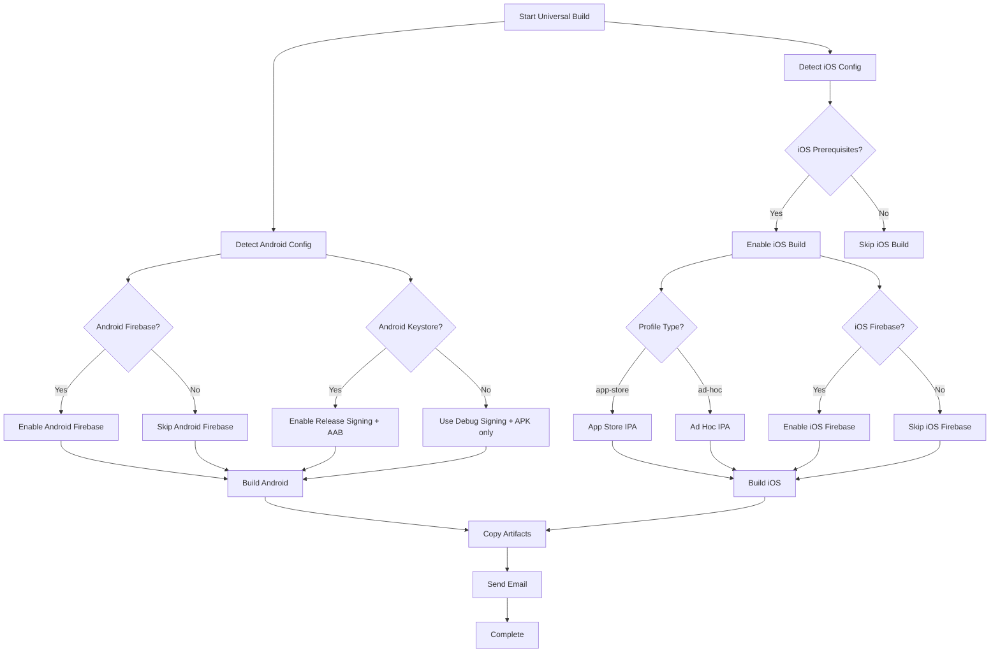

# Universal Combined Workflow Guide

## Overview

The **Universal Combined Workflow** is a single, intelligent workflow that automatically detects and configures all possible Android and iOS build combinations. It replaces multiple separate workflows with one smart solution that adapts to your app's requirements.

## 🚀 What It Does

This workflow automatically detects and builds:

### **Android Configurations:**

- ✅ **APK only** (debug signing) - when no keystore provided
- ✅ **APK + AAB** (release signing) - when keystore provided
- ✅ **With/without Firebase** - based on `PUSH_NOTIFY` and `FIREBASE_CONFIG_ANDROID`
- ✅ **With/without Chatbot** - based on `IS_CHATBOT`
- ✅ **All feature flags** - automatically configured

### **iOS Configurations:**

- ✅ **Ad Hoc IPA** - for beta testing and TestFlight
- ✅ **App Store IPA** - for App Store distribution
- ✅ **With/without Firebase** - based on `PUSH_NOTIFY` and `FIREBASE_CONFIG_IOS`
- ✅ **With/without Chatbot** - based on `IS_CHATBOT`
- ✅ **All feature flags** - automatically configured

## 🔍 Automatic Detection Logic

### **Android Detection:**

```bash
# Firebase Detection
if PUSH_NOTIFY=true AND FIREBASE_CONFIG_ANDROID exists:
    → Enable Firebase for Android

# Keystore Detection
if KEY_STORE_URL + CM_KEYSTORE_PASSWORD + CM_KEY_ALIAS + CM_KEY_PASSWORD exist:
    → Build APK + AAB with release signing
else:
    → Build APK only with debug signing
```

### **iOS Detection:**

```bash
# iOS Build Prerequisites
if BUNDLE_ID + APPLE_TEAM_ID + CERT_PASSWORD + PROFILE_URL exist:
    → Enable iOS build

    # Certificate Detection
    if CERT_P12_URL exists OR (CERT_CER_URL + CERT_KEY_URL exist):
        → Proceed with iOS build
    else:
        → Disable iOS build (missing certificates)

# Profile Type Detection
if PROFILE_TYPE is specified:
    → Use specified profile type
elif APP_STORE_CONNECT_KEY_IDENTIFIER exists:
    → Use "app-store" profile type
else:
    → Use "ad-hoc" profile type (default)

# Firebase Detection
if PUSH_NOTIFY=true AND FIREBASE_CONFIG_IOS exists:
    → Enable Firebase for iOS
```

## 📋 Required Variables

### **Universal (Always Required):**

```yaml
APP_ID: $APP_ID
VERSION_NAME: $VERSION_NAME
VERSION_CODE: $VERSION_CODE
APP_NAME: $APP_NAME
ORG_NAME: $ORG_NAME
WEB_URL: $WEB_URL
EMAIL_ID: $EMAIL_ID
USER_NAME: $USER_NAME
```

### **Android Variables:**

```yaml
# Required for Android build
PKG_NAME: $PKG_NAME

# Optional - for Firebase
PUSH_NOTIFY: $PUSH_NOTIFY
FIREBASE_CONFIG_ANDROID: $FIREBASE_CONFIG_ANDROID

# Optional - for release signing (APK + AAB)
KEY_STORE_URL: $KEY_STORE_URL
CM_KEYSTORE_PASSWORD: $CM_KEYSTORE_PASSWORD
CM_KEY_ALIAS: $CM_KEY_ALIAS
CM_KEY_PASSWORD: $CM_KEY_PASSWORD
```

### **iOS Variables:**

```yaml
# Required for iOS build
BUNDLE_ID: $BUNDLE_ID
APPLE_TEAM_ID: $APPLE_TEAM_ID
CERT_PASSWORD: $CERT_PASSWORD
PROFILE_URL: $PROFILE_URL

# Certificate options (one of these combinations)
CERT_P12_URL: $CERT_P12_URL # Option 1: Pre-made P12
CERT_CER_URL: $CERT_CER_URL # Option 2: Certificate + Key
CERT_KEY_URL: $CERT_KEY_URL # Option 2: Certificate + Key

# Optional - for App Store distribution
PROFILE_TYPE: $PROFILE_TYPE # "app-store" or "ad-hoc"
APP_STORE_CONNECT_KEY_IDENTIFIER: $APP_STORE_CONNECT_KEY_IDENTIFIER

# Optional - for Firebase
PUSH_NOTIFY: $PUSH_NOTIFY
FIREBASE_CONFIG_IOS: $FIREBASE_CONFIG_IOS
APNS_KEY_ID: $APNS_KEY_ID
APNS_AUTH_KEY_URL: $APNS_AUTH_KEY_URL
```

### **Feature Flags (Optional):**

```yaml
IS_CHATBOT: $IS_CHATBOT
IS_DOMAIN_URL: $IS_DOMAIN_URL
IS_SPLASH: $IS_SPLASH
IS_PULLDOWN: $IS_PULLDOWN
IS_BOTTOMMENU: $IS_BOTTOMMENU
IS_LOAD_IND: $IS_LOAD_IND
IS_CAMERA: $IS_CAMERA
IS_LOCATION: $IS_LOCATION
IS_MIC: $IS_MIC
IS_NOTIFICATION: $IS_NOTIFICATION
IS_CONTACT: $IS_CONTACT
IS_BIOMETRIC: $IS_BIOMETRIC
IS_CALENDAR: $IS_CALENDAR
IS_STORAGE: $IS_STORAGE
```

## 🎯 Use Case Examples

### **1. Simple Development Build**

```yaml
# Variables needed:
APP_ID: "1001"
VERSION_NAME: "1.0.0"
VERSION_CODE: "1"
APP_NAME: "My App"
PKG_NAME: "com.example.myapp"
BUNDLE_ID: "com.example.myapp"
APPLE_TEAM_ID: "TEAM123"
CERT_PASSWORD: "password123"
PROFILE_URL: "https://example.com/profile.mobileprovision"
CERT_P12_URL: "https://example.com/cert.p12"
# Result:
# ✅ Android: APK only (debug signing)
# ✅ iOS: Ad Hoc IPA (debug signing)
```

### **2. Production Release with Firebase**

```yaml
# Variables needed:
APP_ID: "1001"
VERSION_NAME: "1.0.0"
VERSION_CODE: "1"
APP_NAME: "My App"
PKG_NAME: "com.example.myapp"
BUNDLE_ID: "com.example.myapp"
APPLE_TEAM_ID: "TEAM123"
CERT_PASSWORD: "password123"
PROFILE_URL: "https://example.com/profile.mobileprovision"
CERT_P12_URL: "https://example.com/cert.p12"
PUSH_NOTIFY: "true"
FIREBASE_CONFIG_ANDROID: "https://example.com/google-services.json"
FIREBASE_CONFIG_IOS: "https://example.com/GoogleService-Info.plist"
KEY_STORE_URL: "https://example.com/keystore.jks"
CM_KEYSTORE_PASSWORD: "keystorepass"
CM_KEY_ALIAS: "keyalias"
CM_KEY_PASSWORD: "keypass"
PROFILE_TYPE: "app-store"
# Result:
# ✅ Android: APK + AAB (release signing) + Firebase
# ✅ iOS: App Store IPA (release signing) + Firebase
```

### **3. Beta Testing Build**

```yaml
# Variables needed:
APP_ID: "1001"
VERSION_NAME: "1.0.0-beta"
VERSION_CODE: "1"
APP_NAME: "My App Beta"
PKG_NAME: "com.example.myapp"
BUNDLE_ID: "com.example.myapp"
APPLE_TEAM_ID: "TEAM123"
CERT_PASSWORD: "password123"
PROFILE_URL: "https://example.com/profile.mobileprovision"
CERT_P12_URL: "https://example.com/cert.p12"
PUSH_NOTIFY: "true"
FIREBASE_CONFIG_ANDROID: "https://example.com/google-services.json"
FIREBASE_CONFIG_IOS: "https://example.com/GoogleService-Info.plist"
# Result:
# ✅ Android: APK only (debug signing) + Firebase
# ✅ iOS: Ad Hoc IPA (debug signing) + Firebase
```

## 📊 Build Output Matrix

| Configuration       | Android Output                 | iOS Output               | Use Case           |
| ------------------- | ------------------------------ | ------------------------ | ------------------ |
| **Minimal**         | APK (debug)                    | Ad Hoc IPA               | Development        |
| **With Firebase**   | APK (debug) + Firebase         | Ad Hoc IPA + Firebase    | Beta testing       |
| **With Keystore**   | APK + AAB (release)            | Ad Hoc IPA               | Pre-production     |
| **Full Production** | APK + AAB (release) + Firebase | App Store IPA + Firebase | Production release |

## 🔧 Build Process Flow



## 🚀 Usage

### **Trigger the Workflow:**

```bash
codemagic build --workflow combined
```

### **With Custom Variables:**

```bash
codemagic build \
  --workflow combined \
  --env APP_NAME="My App" \
  --env VERSION_NAME="1.0.0" \
  --env PUSH_NOTIFY="true" \
  --env PROFILE_TYPE="app-store"
```

## 📱 Artifact Outputs

### **Android Artifacts:**

- `output/android/app-release.apk` (always)
- `output/android/app-release.aab` (if keystore provided)

### **iOS Artifacts:**

- `output/ios/Runner.ipa` (if iOS prerequisites met)

### **Build Reports:**

- `output/android/INSTALL_GUIDE.txt`
- `output/android/installation_report.txt`

## 🔍 Troubleshooting

### **Common Issues:**

1. **iOS Build Skipped**

   - **Cause**: Missing iOS prerequisites
   - **Solution**: Ensure `BUNDLE_ID`, `APPLE_TEAM_ID`, `CERT_PASSWORD`, `PROFILE_URL` are set

2. **Android AAB Not Generated**

   - **Cause**: Missing keystore credentials
   - **Solution**: Provide all keystore variables (`KEY_STORE_URL`, `CM_KEYSTORE_PASSWORD`, etc.)

3. **Firebase Not Enabled**

   - **Cause**: `PUSH_NOTIFY=false` or missing Firebase config
   - **Solution**: Set `PUSH_NOTIFY=true` and provide Firebase config URLs

4. **Profile Type Issues**
   - **Cause**: Invalid `PROFILE_TYPE` value
   - **Solution**: Use `"app-store"` or `"ad-hoc"` only

### **Debug Information:**

The workflow provides detailed logging showing:

- ✅ What configurations were detected
- ✅ Which features are enabled/disabled
- ✅ Build type for each platform
- ✅ Artifact generation status

## 🎯 Best Practices

1. **Start Simple**: Begin with minimal variables and add features incrementally
2. **Test Incrementally**: Test each feature (Firebase, keystore, etc.) separately
3. **Use Descriptive Names**: Use meaningful app names and version numbers
4. **Secure Variables**: Store sensitive data (passwords, keys) securely
5. **Monitor Logs**: Check build logs for configuration detection results

## 📞 Support

For issues with the universal workflow:

1. Check the build logs for configuration detection results
2. Verify all required variables are set correctly
3. Ensure certificate and keystore files are accessible
4. Contact support with build ID and specific error details

---

_This universal workflow provides maximum flexibility while maintaining simplicity - one workflow handles all your app's build requirements automatically!_ 🚀
